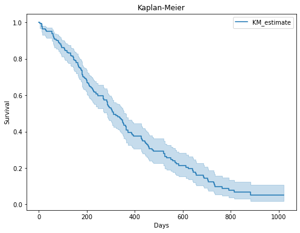
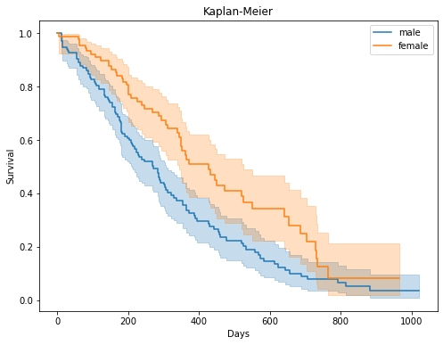

# Data Mining Project - Survival Analytics

Project Details: Advanced lung cancer survival analysis
1. Determine survival chance with Kaplar Meyer Estimation.
2. Diference between Male and Female population

Important links: https://pypi.org/project/lifelines --> Documentation to Survival Analysis

Dataset details:
inst: Institution code
time: Survival time in days
status: censoring status 1=censored, 2=dead
age: Age in years
sex: Male=1 Female=2
ph.ecog: ECOG performance score as rated by the physician. 0=asymptomatic, 1= symptomatic but completely ambulatory, 2= in bed <50% of the day, 3= in bed > 50%of the day but not bedbound, 4 = bedbound
ph.karno: Karnofsky performance score (bad=0-good=100) rated by physician
pat.karno: Karnofsky performance score as rated by patient
meal.cal: Calories consumed at meals
wt.loss: Weight loss in last six months

Dependent Variable = Status


```python
# Import libraries
import pandas as pd
import statsmodels.api as sm
import matplotlib.pyplot as plt
from lifelines import KaplanMeierFitter # Kaplan-Meier model
from lifelines.statistics import logrank_test  # Statistical test
```


```python
# Import Dataset from statsmodel api
dataset = sm.datasets.get_rdataset("lung", package="survival").data
dataset
```


<div>
<style scoped>
    .dataframe tbody tr th:only-of-type {
        vertical-align: middle;
    }

    .dataframe tbody tr th {
        vertical-align: top;
    }

    .dataframe thead th {
        text-align: right;
    }
</style>
<table border="1" class="dataframe">
  <thead>
    <tr style="text-align: right;">
      <th></th>
      <th>inst</th>
      <th>time</th>
      <th>status</th>
      <th>age</th>
      <th>sex</th>
      <th>ph.ecog</th>
      <th>ph.karno</th>
      <th>pat.karno</th>
      <th>meal.cal</th>
      <th>wt.loss</th>
    </tr>
  </thead>
  <tbody>
    <tr>
      <th>0</th>
      <td>3.0</td>
      <td>306</td>
      <td>2</td>
      <td>74</td>
      <td>1</td>
      <td>1.0</td>
      <td>90.0</td>
      <td>100.0</td>
      <td>1175.0</td>
      <td>NaN</td>
    </tr>
    <tr>
      <th>1</th>
      <td>3.0</td>
      <td>455</td>
      <td>2</td>
      <td>68</td>
      <td>1</td>
      <td>0.0</td>
      <td>90.0</td>
      <td>90.0</td>
      <td>1225.0</td>
      <td>15.0</td>
    </tr>
    <tr>
      <th>2</th>
      <td>3.0</td>
      <td>1010</td>
      <td>1</td>
      <td>56</td>
      <td>1</td>
      <td>0.0</td>
      <td>90.0</td>
      <td>90.0</td>
      <td>NaN</td>
      <td>15.0</td>
    </tr>
    <tr>
      <th>3</th>
      <td>5.0</td>
      <td>210</td>
      <td>2</td>
      <td>57</td>
      <td>1</td>
      <td>1.0</td>
      <td>90.0</td>
      <td>60.0</td>
      <td>1150.0</td>
      <td>11.0</td>
    </tr>
    <tr>
      <th>4</th>
      <td>1.0</td>
      <td>883</td>
      <td>2</td>
      <td>60</td>
      <td>1</td>
      <td>0.0</td>
      <td>100.0</td>
      <td>90.0</td>
      <td>NaN</td>
      <td>0.0</td>
    </tr>
    <tr>
      <th>...</th>
      <td>...</td>
      <td>...</td>
      <td>...</td>
      <td>...</td>
      <td>...</td>
      <td>...</td>
      <td>...</td>
      <td>...</td>
      <td>...</td>
      <td>...</td>
    </tr>
    <tr>
      <th>223</th>
      <td>1.0</td>
      <td>188</td>
      <td>1</td>
      <td>77</td>
      <td>1</td>
      <td>1.0</td>
      <td>80.0</td>
      <td>60.0</td>
      <td>NaN</td>
      <td>3.0</td>
    </tr>
    <tr>
      <th>224</th>
      <td>13.0</td>
      <td>191</td>
      <td>1</td>
      <td>39</td>
      <td>1</td>
      <td>0.0</td>
      <td>90.0</td>
      <td>90.0</td>
      <td>2350.0</td>
      <td>-5.0</td>
    </tr>
    <tr>
      <th>225</th>
      <td>32.0</td>
      <td>105</td>
      <td>1</td>
      <td>75</td>
      <td>2</td>
      <td>2.0</td>
      <td>60.0</td>
      <td>70.0</td>
      <td>1025.0</td>
      <td>5.0</td>
    </tr>
    <tr>
      <th>226</th>
      <td>6.0</td>
      <td>174</td>
      <td>1</td>
      <td>66</td>
      <td>1</td>
      <td>1.0</td>
      <td>90.0</td>
      <td>100.0</td>
      <td>1075.0</td>
      <td>1.0</td>
    </tr>
    <tr>
      <th>227</th>
      <td>22.0</td>
      <td>177</td>
      <td>1</td>
      <td>58</td>
      <td>2</td>
      <td>1.0</td>
      <td>80.0</td>
      <td>90.0</td>
      <td>1060.0</td>
      <td>0.0</td>
    </tr>
  </tbody>
</table>
<p>228 rows × 10 columns</p>
</div>


```python
# Transforming dependent variables based on inputs from the document
dataset.loc[dataset.status == 1, "status"] = 0
dataset.loc[dataset.status == 2, "status"] = 1

dataset
```


<div>
<style scoped>
    .dataframe tbody tr th:only-of-type {
        vertical-align: middle;
    }

    .dataframe tbody tr th {
        vertical-align: top;
    }

    .dataframe thead th {
        text-align: right;
    }
</style>
<table border="1" class="dataframe">
  <thead>
    <tr style="text-align: right;">
      <th></th>
      <th>inst</th>
      <th>time</th>
      <th>status</th>
      <th>age</th>
      <th>sex</th>
      <th>ph.ecog</th>
      <th>ph.karno</th>
      <th>pat.karno</th>
      <th>meal.cal</th>
      <th>wt.loss</th>
    </tr>
  </thead>
  <tbody>
    <tr>
      <th>0</th>
      <td>3.0</td>
      <td>306</td>
      <td>1</td>
      <td>74</td>
      <td>1</td>
      <td>1.0</td>
      <td>90.0</td>
      <td>100.0</td>
      <td>1175.0</td>
      <td>NaN</td>
    </tr>
    <tr>
      <th>1</th>
      <td>3.0</td>
      <td>455</td>
      <td>1</td>
      <td>68</td>
      <td>1</td>
      <td>0.0</td>
      <td>90.0</td>
      <td>90.0</td>
      <td>1225.0</td>
      <td>15.0</td>
    </tr>
    <tr>
      <th>2</th>
      <td>3.0</td>
      <td>1010</td>
      <td>0</td>
      <td>56</td>
      <td>1</td>
      <td>0.0</td>
      <td>90.0</td>
      <td>90.0</td>
      <td>NaN</td>
      <td>15.0</td>
    </tr>
    <tr>
      <th>3</th>
      <td>5.0</td>
      <td>210</td>
      <td>1</td>
      <td>57</td>
      <td>1</td>
      <td>1.0</td>
      <td>90.0</td>
      <td>60.0</td>
      <td>1150.0</td>
      <td>11.0</td>
    </tr>
    <tr>
      <th>4</th>
      <td>1.0</td>
      <td>883</td>
      <td>1</td>
      <td>60</td>
      <td>1</td>
      <td>0.0</td>
      <td>100.0</td>
      <td>90.0</td>
      <td>NaN</td>
      <td>0.0</td>
    </tr>
    <tr>
      <th>...</th>
      <td>...</td>
      <td>...</td>
      <td>...</td>
      <td>...</td>
      <td>...</td>
      <td>...</td>
      <td>...</td>
      <td>...</td>
      <td>...</td>
      <td>...</td>
    </tr>
    <tr>
      <th>223</th>
      <td>1.0</td>
      <td>188</td>
      <td>0</td>
      <td>77</td>
      <td>1</td>
      <td>1.0</td>
      <td>80.0</td>
      <td>60.0</td>
      <td>NaN</td>
      <td>3.0</td>
    </tr>
    <tr>
      <th>224</th>
      <td>13.0</td>
      <td>191</td>
      <td>0</td>
      <td>39</td>
      <td>1</td>
      <td>0.0</td>
      <td>90.0</td>
      <td>90.0</td>
      <td>2350.0</td>
      <td>-5.0</td>
    </tr>
    <tr>
      <th>225</th>
      <td>32.0</td>
      <td>105</td>
      <td>0</td>
      <td>75</td>
      <td>2</td>
      <td>2.0</td>
      <td>60.0</td>
      <td>70.0</td>
      <td>1025.0</td>
      <td>5.0</td>
    </tr>
    <tr>
      <th>226</th>
      <td>6.0</td>
      <td>174</td>
      <td>0</td>
      <td>66</td>
      <td>1</td>
      <td>1.0</td>
      <td>90.0</td>
      <td>100.0</td>
      <td>1075.0</td>
      <td>1.0</td>
    </tr>
    <tr>
      <th>227</th>
      <td>22.0</td>
      <td>177</td>
      <td>0</td>
      <td>58</td>
      <td>2</td>
      <td>1.0</td>
      <td>80.0</td>
      <td>90.0</td>
      <td>1060.0</td>
      <td>0.0</td>
    </tr>
  </tbody>
</table>
<p>228 rows × 10 columns</p>
</div>


```python
# Kaplan-Meier estimator

model = KaplanMeierFitter()
model.fit(durations = dataset.time, event_observed = dataset.status)
model.event_table
```


<div>
<style scoped>
    .dataframe tbody tr th:only-of-type {
        vertical-align: middle;
    }

    .dataframe tbody tr th {
        vertical-align: top;
    }

    .dataframe thead th {
        text-align: right;
    }
</style>
<table border="1" class="dataframe">
  <thead>
    <tr style="text-align: right;">
      <th></th>
      <th>removed</th>
      <th>observed</th>
      <th>censored</th>
      <th>entrance</th>
      <th>at_risk</th>
    </tr>
    <tr>
      <th>event_at</th>
      <th></th>
      <th></th>
      <th></th>
      <th></th>
      <th></th>
    </tr>
  </thead>
  <tbody>
    <tr>
      <th>0.0</th>
      <td>0</td>
      <td>0</td>
      <td>0</td>
      <td>228</td>
      <td>228</td>
    </tr>
    <tr>
      <th>5.0</th>
      <td>1</td>
      <td>1</td>
      <td>0</td>
      <td>0</td>
      <td>228</td>
    </tr>
    <tr>
      <th>11.0</th>
      <td>3</td>
      <td>3</td>
      <td>0</td>
      <td>0</td>
      <td>227</td>
    </tr>
    <tr>
      <th>12.0</th>
      <td>1</td>
      <td>1</td>
      <td>0</td>
      <td>0</td>
      <td>224</td>
    </tr>
    <tr>
      <th>13.0</th>
      <td>2</td>
      <td>2</td>
      <td>0</td>
      <td>0</td>
      <td>223</td>
    </tr>
    <tr>
      <th>...</th>
      <td>...</td>
      <td>...</td>
      <td>...</td>
      <td>...</td>
      <td>...</td>
    </tr>
    <tr>
      <th>840.0</th>
      <td>1</td>
      <td>0</td>
      <td>1</td>
      <td>0</td>
      <td>5</td>
    </tr>
    <tr>
      <th>883.0</th>
      <td>1</td>
      <td>1</td>
      <td>0</td>
      <td>0</td>
      <td>4</td>
    </tr>
    <tr>
      <th>965.0</th>
      <td>1</td>
      <td>0</td>
      <td>1</td>
      <td>0</td>
      <td>3</td>
    </tr>
    <tr>
      <th>1010.0</th>
      <td>1</td>
      <td>0</td>
      <td>1</td>
      <td>0</td>
      <td>2</td>
    </tr>
    <tr>
      <th>1022.0</th>
      <td>1</td>
      <td>0</td>
      <td>1</td>
      <td>0</td>
      <td>1</td>
    </tr>
  </tbody>
</table>
<p>187 rows × 5 columns</p>
</div>


```python
# Calculate for specific events

day_5 = model.event_table.iloc[1, :]
print(day_5)
surv_5 = 1 * (1 - day_5.observed / day_5.at_risk)
print(surv_5)
day_11 = model.event_table.iloc[2, :]
surv_11 = surv_5 * (1 - day_5.observed / day_5.at_risk)
print(surv_11)
```

    removed       1
    observed      1
    censored      0
    entrance      0
    at_risk     228
    Name: 5.0, dtype: int32
    0.9956140350877193
    0.9912473068636504
    


```python
# Visualization
model.plot(figsize=(8,6))
plt.title('Kaplan-Meier')
plt.xlabel('Days')
plt.ylabel('Survival')
```


    Text(0, 0.5, 'Survival')


    

    


```python
# Male vs Female
## Create dataframe with males and females

male = dataset.query("sex==1")
female = dataset.query("sex==2")
```


```python
## Kaplan-Meier per gender (Male)

model_males = KaplanMeierFitter()
model_males.fit(durations = male.time, event_observed = male.status)
model_males.event_table
```


<div>
<style scoped>
    .dataframe tbody tr th:only-of-type {
        vertical-align: middle;
    }

    .dataframe tbody tr th {
        vertical-align: top;
    }

    .dataframe thead th {
        text-align: right;
    }
</style>
<table border="1" class="dataframe">
  <thead>
    <tr style="text-align: right;">
      <th></th>
      <th>removed</th>
      <th>observed</th>
      <th>censored</th>
      <th>entrance</th>
      <th>at_risk</th>
    </tr>
    <tr>
      <th>event_at</th>
      <th></th>
      <th></th>
      <th></th>
      <th></th>
      <th></th>
    </tr>
  </thead>
  <tbody>
    <tr>
      <th>0.0</th>
      <td>0</td>
      <td>0</td>
      <td>0</td>
      <td>138</td>
      <td>138</td>
    </tr>
    <tr>
      <th>11.0</th>
      <td>3</td>
      <td>3</td>
      <td>0</td>
      <td>0</td>
      <td>138</td>
    </tr>
    <tr>
      <th>12.0</th>
      <td>1</td>
      <td>1</td>
      <td>0</td>
      <td>0</td>
      <td>135</td>
    </tr>
    <tr>
      <th>13.0</th>
      <td>2</td>
      <td>2</td>
      <td>0</td>
      <td>0</td>
      <td>134</td>
    </tr>
    <tr>
      <th>15.0</th>
      <td>1</td>
      <td>1</td>
      <td>0</td>
      <td>0</td>
      <td>132</td>
    </tr>
    <tr>
      <th>...</th>
      <td>...</td>
      <td>...</td>
      <td>...</td>
      <td>...</td>
      <td>...</td>
    </tr>
    <tr>
      <th>814.0</th>
      <td>1</td>
      <td>1</td>
      <td>0</td>
      <td>0</td>
      <td>5</td>
    </tr>
    <tr>
      <th>840.0</th>
      <td>1</td>
      <td>0</td>
      <td>1</td>
      <td>0</td>
      <td>4</td>
    </tr>
    <tr>
      <th>883.0</th>
      <td>1</td>
      <td>1</td>
      <td>0</td>
      <td>0</td>
      <td>3</td>
    </tr>
    <tr>
      <th>1010.0</th>
      <td>1</td>
      <td>0</td>
      <td>1</td>
      <td>0</td>
      <td>2</td>
    </tr>
    <tr>
      <th>1022.0</th>
      <td>1</td>
      <td>0</td>
      <td>1</td>
      <td>0</td>
      <td>1</td>
    </tr>
  </tbody>
</table>
<p>120 rows × 5 columns</p>
</div>


```python
## Kaplan-Meier per gender (Female)

model_females = KaplanMeierFitter()
model_females.fit(durations = female.time, event_observed = female.status)
model_females.event_table

```


<div>
<style scoped>
    .dataframe tbody tr th:only-of-type {
        vertical-align: middle;
    }

    .dataframe tbody tr th {
        vertical-align: top;
    }

    .dataframe thead th {
        text-align: right;
    }
</style>
<table border="1" class="dataframe">
  <thead>
    <tr style="text-align: right;">
      <th></th>
      <th>removed</th>
      <th>observed</th>
      <th>censored</th>
      <th>entrance</th>
      <th>at_risk</th>
    </tr>
    <tr>
      <th>event_at</th>
      <th></th>
      <th></th>
      <th></th>
      <th></th>
      <th></th>
    </tr>
  </thead>
  <tbody>
    <tr>
      <th>0.0</th>
      <td>0</td>
      <td>0</td>
      <td>0</td>
      <td>90</td>
      <td>90</td>
    </tr>
    <tr>
      <th>5.0</th>
      <td>1</td>
      <td>1</td>
      <td>0</td>
      <td>0</td>
      <td>90</td>
    </tr>
    <tr>
      <th>60.0</th>
      <td>1</td>
      <td>1</td>
      <td>0</td>
      <td>0</td>
      <td>89</td>
    </tr>
    <tr>
      <th>61.0</th>
      <td>1</td>
      <td>1</td>
      <td>0</td>
      <td>0</td>
      <td>88</td>
    </tr>
    <tr>
      <th>62.0</th>
      <td>1</td>
      <td>1</td>
      <td>0</td>
      <td>0</td>
      <td>87</td>
    </tr>
    <tr>
      <th>...</th>
      <td>...</td>
      <td>...</td>
      <td>...</td>
      <td>...</td>
      <td>...</td>
    </tr>
    <tr>
      <th>735.0</th>
      <td>1</td>
      <td>1</td>
      <td>0</td>
      <td>0</td>
      <td>5</td>
    </tr>
    <tr>
      <th>740.0</th>
      <td>1</td>
      <td>0</td>
      <td>1</td>
      <td>0</td>
      <td>4</td>
    </tr>
    <tr>
      <th>765.0</th>
      <td>1</td>
      <td>1</td>
      <td>0</td>
      <td>0</td>
      <td>3</td>
    </tr>
    <tr>
      <th>821.0</th>
      <td>1</td>
      <td>0</td>
      <td>1</td>
      <td>0</td>
      <td>2</td>
    </tr>
    <tr>
      <th>965.0</th>
      <td>1</td>
      <td>0</td>
      <td>1</td>
      <td>0</td>
      <td>1</td>
    </tr>
  </tbody>
</table>
<p>88 rows × 5 columns</p>
</div>


```python
# Visualize male vs female survivor analysis

model_males.plot(figsize=(8,6), label="male")
model_females.plot(label="female")
plt.title('Kaplan-Meier')
plt.xlabel('Days')
plt.ylabel('Survival')
```


    Text(0, 0.5, 'Survival')


    

    


RESULT: The curve shows difference between group of Males and Females, but we
need to run statistical test to make sure results are right

Run statistical test(logrank test) to determine whether there is difference between male and female survival curve


```python
logrank_test(durations_A = male.time, durations_B = female.time,
             event_observed_A = male.status, event_observed_B = female.status)
```


<div>
<style scoped>
    .dataframe tbody tr th:only-of-type {
        vertical-align: middle;
    }

    .dataframe tbody tr th {
        vertical-align: top;
    }

    .dataframe thead th {
        text-align: right;
    }
</style>
<table border="1" class="dataframe">
  <tbody>
    <tr>
      <th>t_0</th>
      <td>-1</td>
    </tr>
    <tr>
      <th>null_distribution</th>
      <td>chi squared</td>
    </tr>
    <tr>
      <th>degrees_of_freedom</th>
      <td>1</td>
    </tr>
    <tr>
      <th>test_name</th>
      <td>logrank_test</td>
    </tr>
  </tbody>
</table>
</div><table border="1" class="dataframe">
  <thead>
    <tr style="text-align: right;">
      <th></th>
      <th>test_statistic</th>
      <th>p</th>
      <th>-log2(p)</th>
    </tr>
  </thead>
  <tbody>
    <tr>
      <th>0</th>
      <td>10.33</td>
      <td>&lt;0.005</td>
      <td>9.57</td>
    </tr>
  </tbody>
</table>


RESULT: Since the p-value is very less, it shows that there is difference between males and females group, hence statistical test backs the visualization


```python
###End
```
